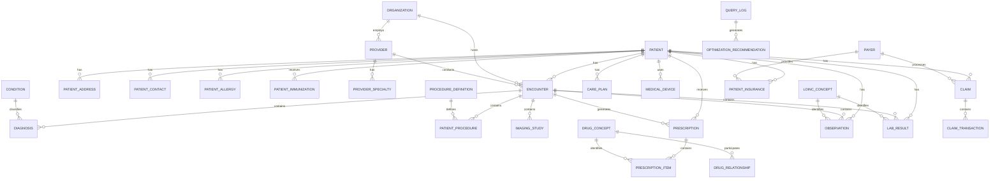

```mermaid

erDiagram

    PATIENT ||--o{ ENCOUNTER : has
    PATIENT ||--o{ PATIENT_ADDRESS : has
    PATIENT ||--o{ PATIENT_CONTACT : has
    PATIENT ||--o{ PATIENT_ALLERGY : has
    PATIENT ||--o{ PATIENT_IMMUNIZATION : receives

    ORGANIZATION ||--o{ PROVIDER : employs
    ORGANIZATION ||--o{ ENCOUNTER : hosts

    PROVIDER ||--o{ ENCOUNTER : conducts
    PROVIDER ||--o{ PROVIDER_SPECIALTY : has

    ENCOUNTER ||--o{ DIAGNOSIS : contains
    CONDITION ||--o{ DIAGNOSIS : classifies

    ENCOUNTER ||--o{ PATIENT_PROCEDURE : contains
    PROCEDURE_DEFINITION ||--o{ PATIENT_PROCEDURE : defines

    PATIENT ||--o{ CARE_PLAN : has
    PATIENT ||--o{ MEDICAL_DEVICE : uses
    ENCOUNTER ||--o{ IMAGING_STUDY : contains

    PATIENT ||--o{ PRESCRIPTION : receives
    ENCOUNTER ||--o{ PRESCRIPTION : generates

    PRESCRIPTION ||--o{ PRESCRIPTION_ITEM : contains
    DRUG_CONCEPT ||--o{ PRESCRIPTION_ITEM : identifies

    DRUG_CONCEPT ||--o{ DRUG_RELATIONSHIP : participates

    PATIENT ||--o{ OBSERVATION : has
    ENCOUNTER ||--o{ OBSERVATION : contains
    LOINC_CONCEPT ||--o{ OBSERVATION : identifies

    PATIENT ||--o{ LAB_RESULT : has
    ENCOUNTER ||--o{ LAB_RESULT : contains
    LOINC_CONCEPT ||--o{ LAB_RESULT : identifies

    PATIENT ||--o{ PATIENT_INSURANCE : has
    PAYER ||--o{ PATIENT_INSURANCE : provides

    PATIENT ||--o{ CLAIM : has
    PAYER ||--o{ CLAIM : processes
    CLAIM ||--o{ CLAIM_TRANSACTION : contains

    QUERY_LOG ||--o{ OPTIMIZATION_RECOMMENDATION : generates

```